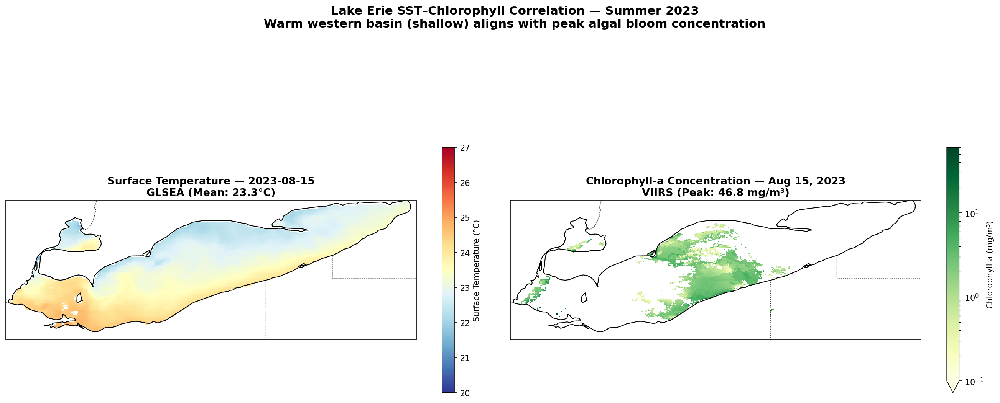

# 01 — Lake Erie Surface Temperature & Algal Bloom Analysis

<p align="center">
  
</p>

**A complete satellite oceanography pipeline** — from raw NOAA data to publication-quality visualizations — analyzing Lake Erie's summer thermal regime and its connection to harmful algal blooms.

*Part of [Project Blue Nexus](../README.md)*

---

## What This Notebook Does

Lake Erie is the shallowest of the Great Lakes and ground zero for toxic *Microcystis* blooms that threaten drinking water for 11 million people. This analysis builds an automated data pipeline across 10 steps:

1. **Data Acquisition** — Fetches SST and chlorophyll-a from NOAA ERDDAP with retry logic and caching
2. **Peak Temperature Map** — Identifies and maps the hottest day of summer 2023
3. **Seasonal Curve** — 122-day warming arc with HAB threshold overlay
4. **June vs. August Comparison** — Side-by-side maps showing +7.4°C seasonal warming
5. **Multi-Year Comparison** — Five years (2019–2023) of July–August statistics
6. **Basin Dynamics** — Western vs. Eastern basin thermal gradient (up to 3.8°C)
7. **Temperature Anomaly** — 2023 deviation from 4-year baseline (–0.84°C cooler)
8. **Chlorophyll-a Discovery** — Auto-detects VIIRS dataset variables from ERDDAP metadata
9. **Bloom Map** — Log-scaled chlorophyll concentration (peak: 46.8 mg/m³)
10. **SST–Chlorophyll Correlation** — Side-by-side thermal and biological maps

---

## Key Findings

| Metric | Value |
|--------|-------|
| Peak lake-wide average SST | **24.0°C** (August 4, 2023) |
| Pixel-level maximum | **27.0°C** |
| Days above 20°C HAB threshold | **93 of 122** (~10 weeks) |
| Western–Eastern basin gradient | **up to 3.8°C** |
| 2023 anomaly vs. 2019–2022 | **–0.84°C** (coolest of 5 years) |
| Peak chlorophyll-a (Aug 15) | **46.8 mg/m³** (western basin) |

<p align="center">
  
</p>

---

## Running the Notebook

```bash
cd 01_lake_erie_sst
jupyter notebook 01_Lake_Erie_SST_Analysis.ipynb
# → Kernel → Restart & Run All
```

First run downloads ~25 MB from NOAA (3–5 min with cooldown delays). Data caches to `../data/` — subsequent runs are instant. Eight visualizations are saved to `output/`.

---

## Visualizations

| Output | Description |
|--------|-------------|
| `lake_erie_sst_peak_2023.png` | Peak SST map — August 4, 2023 |
| `lake_erie_sst_timeseries_2023.png` | 122-day seasonal temperature curve |
| `lake_erie_june_vs_august_2023.png` | June vs. August side-by-side |
| `lake_erie_multiyear_comparison.png` | 5-year SST overlay + threshold bar chart |
| `lake_erie_basin_comparison_2023.png` | Western vs. Eastern basin dynamics |
| `lake_erie_anomaly_2023.png` | 2023 temperature anomaly map |
| `lake_erie_bloom_map.png` | Chlorophyll-a bloom intensity |
| `lake_erie_sst_chl_correlation.png` | SST + Chlorophyll side-by-side |

<p align="center">
  
  <br>
  <em>93 days above the harmful algal bloom risk threshold.</em>
</p>

