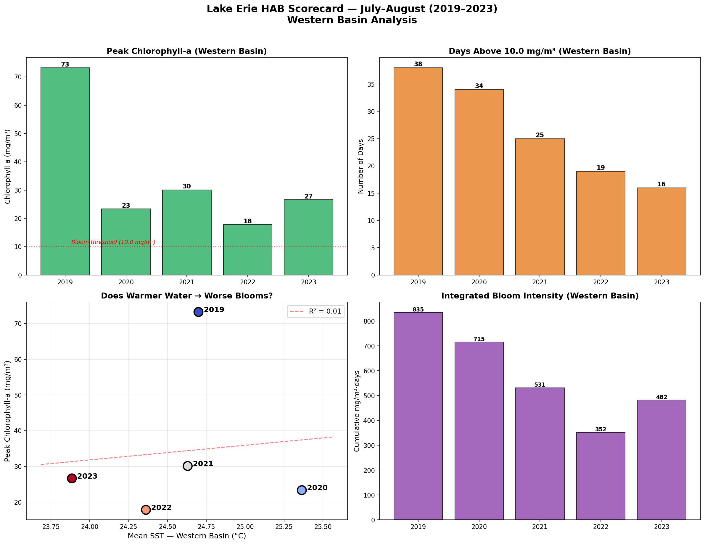

# 02 — Lake Erie Harmful Algal Bloom Analysis

<p align="center">
  
</p>

**Quantifying the relationship between surface temperature and harmful algal bloom intensity** — temporal correlation, lag analysis, multi-year bloom severity scoring, and spatial bloom progression mapping.

*Part of [Project Blue Nexus](../README.md) · Builds on [Notebook 01: SST Analysis](../01_lake_erie_sst/)*

---

## What This Notebook Does

Notebook 01 established that warm SST and elevated chlorophyll-a overlap spatially. This notebook asks the harder questions:

1. **Paired Time Series** — Full-summer SST + chlorophyll curves for the western basin
2. **Data Completeness** — Assessing VIIRS cloud-cover gaps and creating daily composites
3. **Statistical Correlation** — Pearson correlation + log-linear regression (R²)
4. **Lag Analysis** — Does chlorophyll peak *after* SST? Cross-correlation up to ±30 days
5. **Multi-Year Scorecard** — 5-year HAB severity metrics (peak concentration, bloom days, integrated intensity)
6. **Spatial Progression** — Monthly composite maps showing bloom spread June → September

---

## Running the Notebook

**Requires Notebook 01 data cache** — run `01_lake_erie_sst` first, or ensure `../data/` contains the SST `.nc` files.

```bash
cd 02_lake_erie_hab
jupyter notebook 02_Lake_Erie_HAB_Analysis.ipynb
# → Kernel → Restart & Run All
```

First run fetches ~50 MB of chlorophyll data from NOAA (5–10 min with cooldown delays). Cached for subsequent runs.

---

## Visualizations

| Output | Description |
|--------|-------------|
| `hab_sst_chl_timeseries_2023.png` | Dual-axis SST + Chlorophyll time series (western basin) |
| `hab_correlation_analysis.png` | Scatter plot with regression + lag cross-correlation |
| `hab_multiyear_scorecard.png` | 4-panel multi-year HAB severity comparison |
| `hab_monthly_progression.png` | Monthly chlorophyll composite maps (Jun–Sep) |

