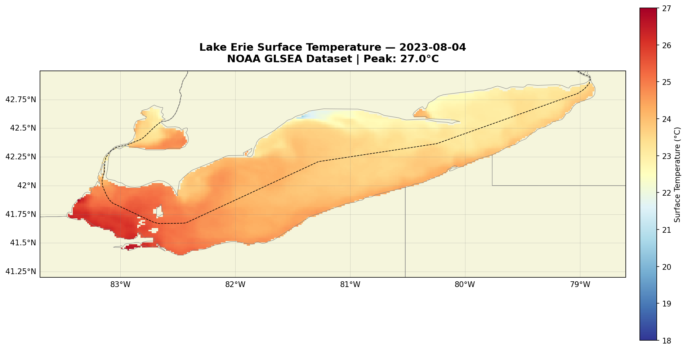
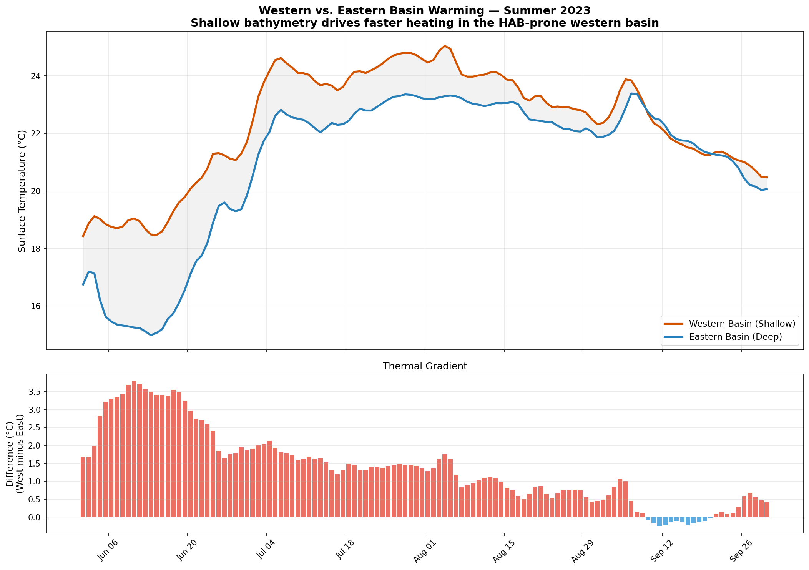
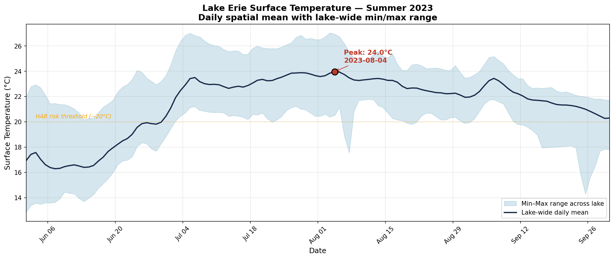

# 🌊 Project Blue Nexus — Lake Erie Surface Temperature & Algal Bloom Analysis

<p align="center">
  
</p>

**A complete satellite oceanography pipeline** — from raw NOAA data to publication-quality visualizations — analyzing Lake Erie's summer thermal regime and its connection to harmful algal blooms (HABs).

Built with Python, xarray, cartopy, and NOAA's ERDDAP scientific data service.

---

## 🔬 What This Project Does

Lake Erie is the shallowest of the Great Lakes and ground zero for toxic *Microcystis* blooms that threaten drinking water for 11 million people. In 2014, a single bloom shut down Toledo's water supply for three days.

This project builds an **automated data pipeline** that:

1. **Fetches** satellite-derived Sea Surface Temperature (SST) and chlorophyll-a data from NOAA's ERDDAP servers
2. **Processes** 122 days of gridded data across a 115×337 point grid (~1.4 km resolution)
3. **Visualizes** spatial patterns, seasonal dynamics, multi-year trends, and SST–bloom correlations
4. **Identifies** the physical mechanisms linking shallow bathymetry → warm water → algal bloom concentration

The analysis covers summer 2023 in depth and compares five years (2019–2023) of peak-summer conditions.

---

## 📊 Key Findings

### 2023 Summer Thermal Profile

| Metric | Value |
|--------|-------|
| Peak lake-wide average SST | **24.0°C** (August 4, 2023) |
| Pixel-level maximum | **27.0°C** |
| Days above 20°C HAB threshold | **93 of 122** (~10 weeks) |
| June → August warming | **+7.4°C** lake-wide average |

### Basin-Scale Dynamics

The western basin (avg depth ~7.4 m) consistently leads the eastern basin (up to 64 m) by **up to 3.8°C**, driven by bathymetric differences. This thermal gradient directly overlaps the spatial distribution of nutrient loading from the Maumee River watershed.

<p align="center">
  
</p>

### Multi-Year Context (2019–2023)

| Year | Jul–Aug Mean | Pixel Max | Days >24°C |
|------|-------------|-----------|------------|
| 2019 | 23.8°C | 27.9°C | 32 |
| 2020 | 24.5°C | 30.0°C | 57 |
| 2021 | 23.6°C | 28.4°C | 25 |
| 2022 | 23.7°C | 27.5°C | 35 |
| **2023** | **23.1°C** | **27.0°C** | **0** |

2023 was the coolest July–August of the five-year window (−0.84°C below baseline), yet all 62 days still exceeded 20°C in every year analyzed — the HAB risk threshold is exceeded every summer without exception.

<p align="center">
  
</p>

### SST–Chlorophyll Connection

Chlorophyll-a concentrations peaked at **46.8 mg/m³** in the western basin on August 15, 2023 — well above the ~10 mg/m³ bloom threshold. The spatial pattern of elevated chlorophyll closely mirrors the SST hotspot in the shallow west.

<p align="center">
  
</p>

---

## 🗂️ Project Structure

```
BlueNexus/
├── 01_Lake_Erie_SST_Analysis.ipynb    # Main analysis notebook (10 steps)
├── README.md                          # This file
├── requirements.txt                   # Python dependencies
├── LICENSE                            # MIT License
│
├── data/                              # Cached NetCDF data (not tracked in git)
│   ├── lake_erie_sst_2023_june.nc
│   ├── lake_erie_sst_2023_july.nc
│   ├── lake_erie_sst_2023_august.nc
│   ├── lake_erie_sst_2023_september.nc
│   ├── lake_erie_sst_2019_jul_aug.nc
│   ├── lake_erie_sst_2020_jul_aug.nc
│   ├── lake_erie_sst_2021_jul_aug.nc
│   ├── lake_erie_sst_2022_jul_aug.nc
│   ├── lake_erie_sst_2023_jul_aug.nc
│   └── lake_erie_chl_2023_aug15.nc
│
└── output/                            # Generated visualizations
    ├── lake_erie_sst_peak_2023.png
    ├── lake_erie_sst_timeseries_2023.png
    ├── lake_erie_june_vs_august_2023.png
    ├── lake_erie_multiyear_comparison.png
    ├── lake_erie_basin_comparison_2023.png
    ├── lake_erie_anomaly_2023.png
    ├── lake_erie_bloom_map.png
    └── lake_erie_sst_chl_correlation.png
```

---

## 🚀 Getting Started

### Prerequisites

- Python 3.10+
- Internet connection (for initial data download from NOAA — ~25 MB total)

### Installation

```bash
# Clone the repository
git clone https://github.com/YOUR_USERNAME/BlueNexus.git
cd BlueNexus

# Create and activate virtual environment
python -m venv ocean_env
# Windows:
ocean_env\Scripts\activate
# macOS/Linux:
source ocean_env/bin/activate

# Install dependencies
pip install -r requirements.txt

# Launch Jupyter
jupyter notebook 01_Lake_Erie_SST_Analysis.ipynb
```

### First Run

Run all cells in order (**Kernel → Restart & Run All**). The notebook will:

1. Download ~25 MB of SST and chlorophyll data from NOAA (takes 3–5 minutes with server cooldown delays)
2. Cache all data locally as `.nc` files — subsequent runs skip the download
3. Generate 8 publication-quality visualizations saved to `output/`

> **Note:** NOAA's ERDDAP server throttles rapid requests. The notebook includes 15-second cooldown delays between downloads. If you see connection errors, wait a few minutes and re-run — the caching logic will pick up where it left off.

---

## 📡 Data Sources

| Dataset | Provider | ID | Resolution | Coverage |
|---------|----------|----|------------|----------|
| [GLSEA](https://apps.glerl.noaa.gov/erddap/griddap/GLSEA_GCS.html) | NOAA GLERL | `GLSEA_GCS` | ~1.4 km daily | 1995–2023 |
| [VIIRS Chlorophyll](https://apps.glerl.noaa.gov/erddap/griddap/LE_CHL_VIIRS_SQ.html) | NOAA GLERL | `LE_CHL_VIIRS_SQ` | ~0.6 km | 2012–present |

Both datasets are accessed via [ERDDAP](https://coastwatch.pfeg.noaa.gov/erddap/information.html), NOAA's standardized REST API for scientific data. Data is downloaded as NetCDF files — the standard binary format for multidimensional geophysical data.

---

## 🛠️ Technical Stack

| Tool | Role |
|------|------|
| **Python 3.10** | Core language |
| **xarray** | Multidimensional array operations on labeled NetCDF data |
| **cartopy** | Cartographic projections, coastlines, and political boundaries |
| **matplotlib** | Publication-quality figure rendering |
| **pandas** | Tabular statistics and time series handling |
| **NumPy** | Numerical computation |
| **requests** | HTTP data fetching with retry logic |
| **Jupyter Notebook** | Interactive analysis and narrative documentation |

---

## 🔭 Roadmap

- [x] **Phase 1:** Environment setup, data pipeline, core visualizations
- [x] **Phase 2:** Multi-year comparison, basin dynamics, anomaly analysis
- [x] **Phase 3:** Chlorophyll-a integration, SST–bloom correlation
- [x] **Phase 4:** Portfolio polish, GitHub publication
- [ ] **Phase 5:** Real-time monitoring dashboard, automated data fetching
- [ ] **Phase 6:** CTD profile analysis, ocean current visualization
- [ ] **Phase 7:** AI-assisted report generation, RAG pipeline for research papers

---

## 📄 License

This project is licensed under the MIT License — see [LICENSE](LICENSE) for details.

NOAA data is in the public domain. GLSEA and VIIRS datasets are provided by [NOAA Great Lakes Environmental Research Laboratory](https://www.glerl.noaa.gov/).

---

## 👤 Author

**Ryan Jones** — Software engineer based near Lake Erie, learning satellite oceanography by building. This project is part of an ongoing effort to develop automated tools for Great Lakes environmental monitoring.

---

<p align="center">
  
  <br>
  <em>Lake Erie summer 2023 — 93 days above the harmful algal bloom risk threshold.</em>
</p>
